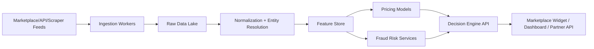

# Market Anomaly AI - System Design

## Production Architecture

Market Anomaly AI is built as an API-first price intelligence platform. The MVP in this repository implements the deterministic pricing core, while production should add streaming ingestion, feature storage, category-specific ML models, image similarity, and seller graph intelligence.

## MVP Scope

- Jordan-first pricing engine using JOD.
- Phones, cars, and property demo cohorts.
- Arabic and English normalization.
- Robust comparable-market price ranges.
- Classification into `normal`, `overpriced`, or `underpriced`.
- Fraud-risk score with explainable signals.

## Production Services

- `ingestion-service`: partner feeds, permitted scraping, source scheduling, retry handling.
- `normalization-service`: bilingual text cleanup, entity extraction, taxonomy mapping.
- `feature-service`: online/offline feature store.
- `pricing-service`: cohort statistics, quantile models, category regressors.
- `risk-service`: seller graph, duplicate listings, suspicious text, image reuse.
- `decision-api`: low-latency scoring surface for partners.
- `dashboard`: analyst and marketplace moderation workflows.

## Data Controls

- Hash seller identifiers and phone numbers before storage.
- Keep personal data out of model training unless explicitly needed and lawful.
- Store consent/source metadata for partner feeds.
- Maintain audit logs for automated high-risk decisions.
- Separate public buyer messages from internal fraud risk explanations.

## Model Evolution

1. Robust statistics by comparable cohort.
2. Category-specific gradient boosted regression on log price.
3. Quantile regression for price intervals.
4. Text/image embeddings for duplicate and fraud signals.
5. Country-level calibration for expansion beyond Jordan.

